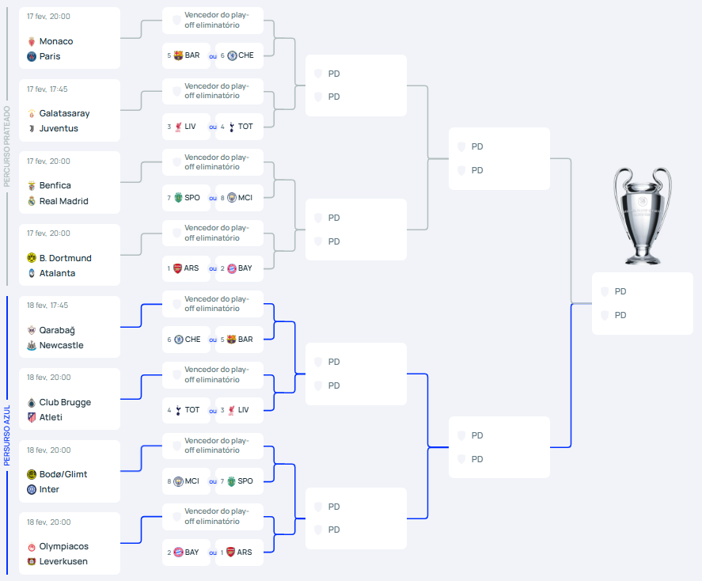

# CS03 — Campeonatos Desportivos (Desportos Colectivos)

Este repositório descreve um sistema para gerir **campeonatos** de desportos colectivos com **calendário por jornadas**, **jogos**, **resultados** e **ocorrências** (eventos do jogo).

    <figure>
        
        <figcaption>UEFA Champions League 2025/2026 fase final.</figcaption>
    </figure>

---

## Índice
- [Inception — Business Modeling & Requirements](inception.md)
- [Elaboration — Analysis & Design](elaboration.md)

---

## Regras o que o sistema tem de suportar
- O sistema pode aplicar-se a **qualquer modalidade**, *individual ou colectiva*, onde haja confronto directo entre pares.
- Um **campeonato** é composto por **jogos entre duas equipas** e pode ser por:
  - **eliminação directa**
  - **pontuação**
  - **híbrido por fases** (cada fase com formato próprio)
- Existe um **calendário** dividido por **jornadas**, mesmo no caso de modelo por eliminação.
  - Cada jornada tem jogos, garantindo que **cada equipa participa no máximo em 1 e não mais do que 1 jogo**.
  - O calendário é definido **antes do início do campeonato** (jornadas conhecidas antes do 1º jogo).
- Cada jogo tem: **data**, **resultado final** e **lista de ocorrências**.
- Cada ocorrência regista: **tipo** (seleccionado de lista definida pela organização), **jogador(es) intervenientes** e **tempo de jogo**.

    <figure>
        
        <figcaption>Ocorrências na final do Open de Tenis da Australia 2026.</figcaption>
    </figure>

- Cada equipa tem jogadores caracterizados por dados civis (**nome**, **identificação cívil** e **data de nascimento** são obrigatórios, pode ter outros), **ano de início de actividade** e **função no campo**.
- O trajecto desportivo do jogador é mantido por **intervalos de tempo** em que representou um clube; 
- um jogador **não pode representar duas equipas simultaneamente**.

